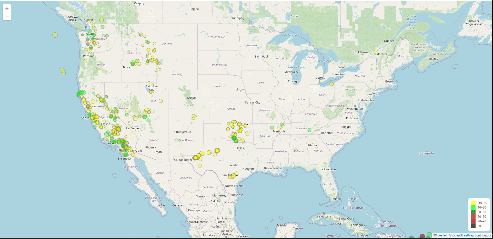

# leaflet-challenge
The USGS provides earthquake data in a number of different formats, updated every 5 minutes. In this project, we will visualize earthquake data from all over the world each day,for the past 7 days and developing a way to better educate the public and other government organizations on issues facing our planet.


Link from where we will get our data: https://earthquake.usgs.gov/earthquakes/feed/v1.0/geojson.php

## What we will learn from this project:

- How to interact between HTML,CSS and JavaScript code

- How to retrieve data from a GeoJson file (provided in URL link: https://earthquake.usgs.gov/earthquakes/feed/v1.0/summary/all_week.geojson)

- Using Leaflet to create a map from the dataset

## Instructions: 
 
  - Use the D3 library to get the dataset from the URL provided,

  - Use Leaflet to create a map that plots all the earthquakes from the dataset based on their longitude and latitude and the data markers should reflect the magnitude of the earthquake by their size and the depth of the earthquake by color.

  - Include popups that provide additional information about the earthquake when its associated marker is clicked,

  - Create a legend that will provide context for your map data.

 ## Program:

### Tools:

- Visual Studio Code (VSCode): is a free, open-source code editor developed by Microsoft.

- Javascript: is a programming language primarily used for web development.

- CSS: is a stylesheet language used for describing the presentation and formatting of documents written in HTML.

- HTML: is the standard markup language for documents designed to be displayed in a web browser.

- D3.js:  is a JavaScript library for manipulating and visualizing data in web browsers.

- Leaflet: is an open-source JavaScript library for interactive maps.

- OpenStreetMap: is a mapping project for creating and providing free geographic data and mapping.

### Code:

#### HTML: index.html

```
<!DOCTYPE html>
<html lang="en">

<head>
  <meta charset="UTF-8">
  <meta name="viewport" content="width=device-width, initial-scale=1.0">
  <meta http-equiv="X-UA-Compatible" content="ie=edge">
  <title>Leaflet Step-1</title>

  <!-- Leaflet CSS -->
  <link rel="stylesheet" href="https://unpkg.com/leaflet@1.9.4/dist/leaflet.css"
    integrity="sha256-p4NxAoJBhIIN+hmNHrzRCf9tD/miZyoHS5obTRR9BMY="
    crossorigin="" />

  <!-- Our CSS -->
  <link rel="stylesheet" type="text/css" href="static/css/style.css">
</head>

<body>

  <!-- The div that holds our map -->
  <div id="map"></div>

  <!-- Leaflet JS -->
  <script src="https://unpkg.com/leaflet@1.9.4/dist/leaflet.js"
    integrity="sha256-20nQCchB9co0qIjJZRGuk2/Z9VM+kNiyxNV1lvTlZBo="
    crossorigin=""></script>
  <!-- D3 JavaScript -->
  <script src="https://d3js.org/d3.v7.min.js"></script>
  <!-- Our JavaScript -->
  <script type="text/javascript" src="static/js/logic.js"></script>
</body>

</html>
```

#### CSS: style.css

```
body {
  padding: 0;
  margin: 0;
}

#map,
body,
html {
  height: 100%;
}
.legend {
  padding: 10px;
  line-height: 18px;
  color: #555;
  background-color: #fff;
  border-radius: 5px;
}
.legend i {
  float: left;
  width: 18px;
  height: 18px;
  margin-right: 8px;
  opacity: 0.7;
}
```
#### JavaScript: logic.js

```
// Initialize the map
let myMap = L.map("map", {
    center: [37.0902, -95.7129],
    zoom: 5
});

// Add a tile layer 
L.tileLayer('https://{s}.tile.openstreetmap.org/{z}/{x}/{y}.png', {
    attribution: '&copy; <a href="https://www.openstreetmap.org/copyright">OpenStreetMap</a> contributors'
}).addTo(myMap);

// Define the URL for earthquake data
let url = "https://earthquake.usgs.gov/earthquakes/feed/v1.0/summary/all_week.geojson";

// Define a function for color based on depth
function getColor(depth) {
    
    if (depth <= 10) {
        return '#FFFF00';} // yellow
    else if (depth <= 10) {
        return '#BC3500';}  // orange
    else if (depth <= 30) {
        return '#00FF00';}  // light green
    else if (depth <= 50) {
        return '#006400';}  // dark green
    else if (depth <= 70) {
        return '#BC0000';}  // red
    else if (depth <= 90) {
            return '#8B0000';}  // dark red
    else {
        return '#000000'; // black
    }
}

// Legend:

// Create the legend 
var legend = L.control({ position: 'bottomright' });
// Define the legend and create a new HTML <div>
legend.onAdd = function (map) {
    var div = L.DomUtil.create('div', 'info legend');
    var grades = [-10,10,30,50,70,90];
    var labels = [];

    // Create labels with colors
    for (var i = 0; i < grades.length; i++) {
        div.innerHTML +=
            '<i style="background-color:' + getColor(grades[i] + 1) + '"></i> ' +
            grades[i] + (grades[i + 1] ? '&ndash;' + grades[i + 1] + '<br>' : '+');
    }

    return div;
};
// Add the legend to the map
legend.addTo(myMap);

// Use D3.js to load earthquake data and create markers
d3.json(url).then(function(response) {
    response.features.forEach(function (quake) {
        let magnitude = quake.properties.mag;
        let coordinates = quake.geometry.coordinates;
        let place = quake.properties.place; 
        let depth = quake.geometry.coordinates[2];
        let time = quake.properties.time;
        date = new Date (time)

        // Create a circle marker
        let marker = L.circleMarker([coordinates[1], coordinates[0]], {
            radius: Math.sqrt(magnitude) * 5,
            fillColor: getColor(depth),
            color: 'gray',
            weight: 1,
            opacity: .8,
            fillOpacity: 0.35
        });

        // Build the popup content with magnitude and place information
        let popup = `<strong>Magnitude:</strong> ${magnitude}<br><strong>Place:</strong> ${place}<br><strong>Time:</strong>${date}</strong>`;

        // Bind the popup with earthquake details and add the marker to the map
        marker.bindPopup(popup).addTo(myMap);
    });
});

```
#### Map:
 


